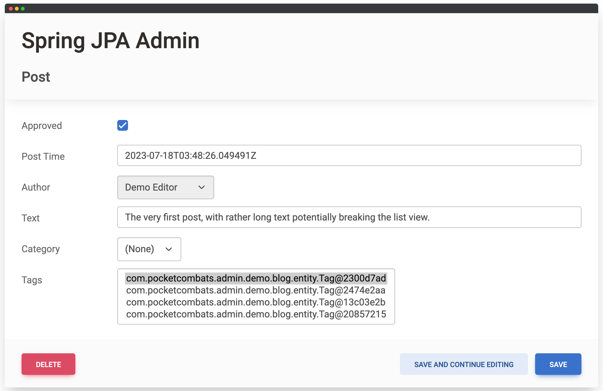
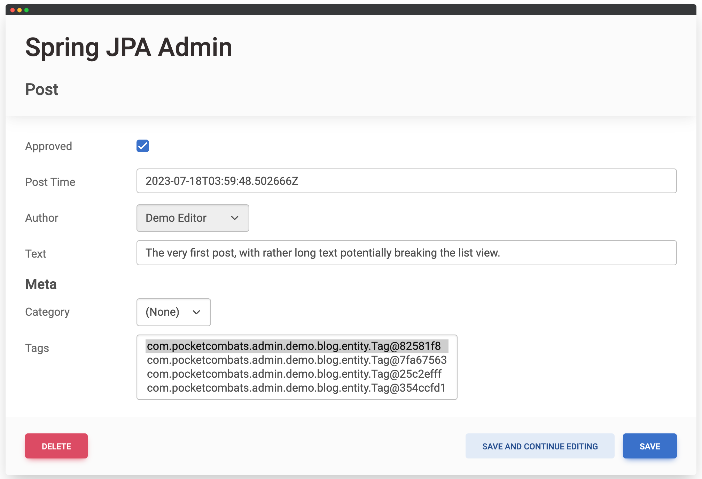
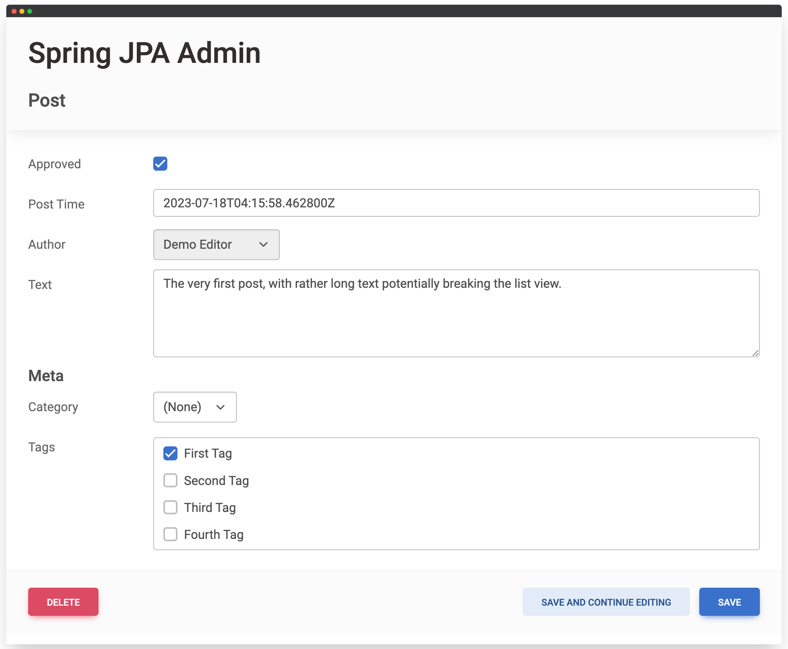
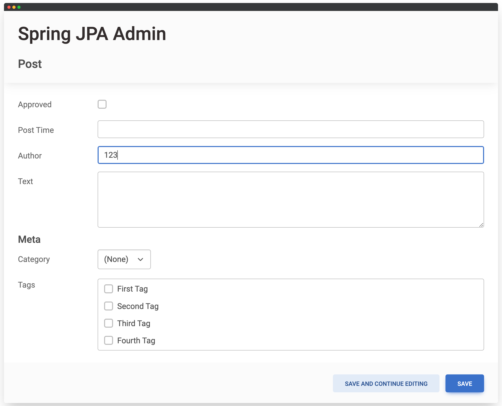
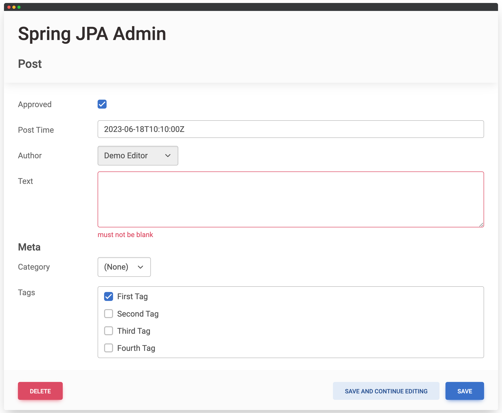
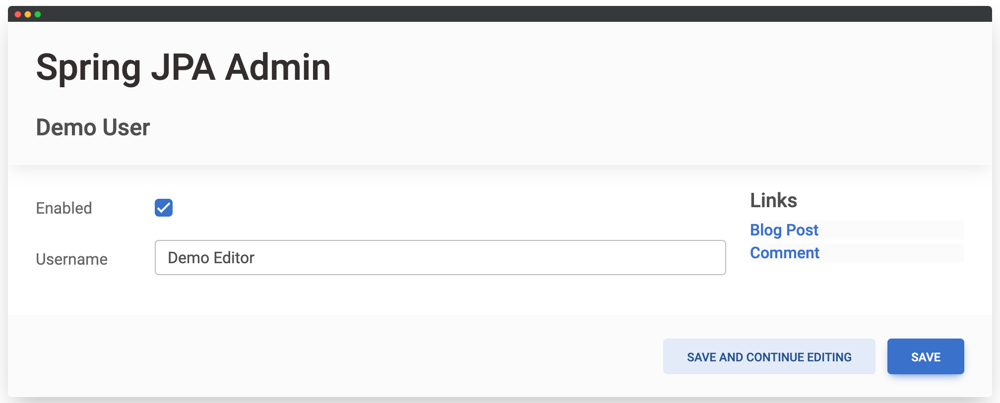
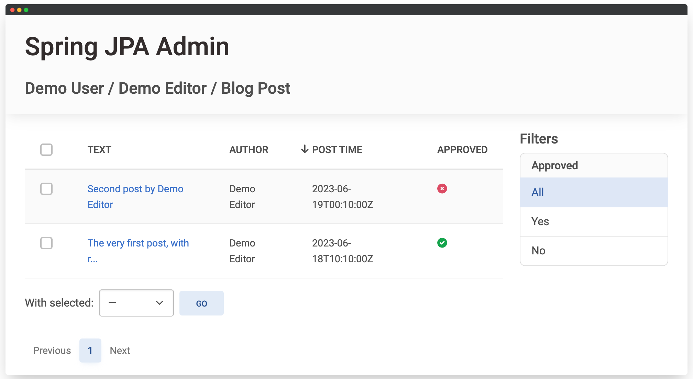
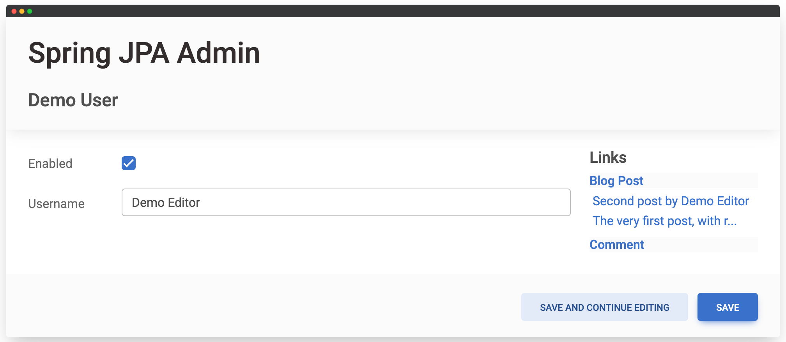

# Spring JPA Admin

Spring JPA Admin is a powerful library built on top of Spring Boot, JPA and Thymeleaf, designed to simplify the development of administrative interfaces. 
This library reads entity metadata to provide a user-friendly and highly customizable admin interface, enabling trusted users to manage content.

## Requirements
- Java 17+
- Spring Boot 3.1+
- Jakarta Persistence API (JPA) 3.1+

## Installation
Spring JPA Admin consists of two main artifacts:

1. **Annotations** (`com.pocketcombats.spring-jpa-admin:annotations`): Required in modules that register entities with the admin site.
2. **Library** (`com.pocketcombats.spring-jpa-admin:lib`): Core functionality for the admin site.

### Maven
```xml
<dependencies>
    <!-- Annotations (can be in a separate module) -->
    <dependency>
        <groupId>com.pocketcombats.spring-jpa-admin</groupId>
        <artifactId>annotations</artifactId>
        <version>${spring-jpa-admin.version}</version>
    </dependency>
  
    <!-- Admin site -->
    <dependency>
        <groupId>com.pocketcombats.spring-jpa-admin</groupId>
        <artifactId>lib</artifactId>
        <version>${spring-jpa-admin.version}</version>
        <scope>runtime</scope>
    </dependency>
</dependencies>
```

### Gradle
```kotlin
dependencies {
    api(platform("com.pocketcombats.spring-jpa-admin:bom:1.0.1"))

    // Annotations
    implementation("com.pocketcombats.spring-jpa-admin:annotations")
  
    // Admin site
    runtimeOnly("com.pocketcombats.spring-jpa-admin:lib")
}
```

## Security
Spring JPA Admin ensures the security of sensitive endpoints by requiring the `"ROLE_JPA_ADMIN"` role. Users without this role will not be able to access the admin interface.  
Currently, the library doesn't provide fine-grained per-model permission configuration, but you can implement custom security logic using Spring Security.

For authentication, you can use the [Authentication Plugin](#authentication-plugin) or integrate with your existing authentication.

## Quick start
To quickly grasp the capabilities of Spring JPA Admin, we recommend exploring the included `demo` application.
This application serves as a practical showcase of various features, allowing you to replicate and customize them in your own project.  
Here we'll recreate some of its parts.

### Annotating Entities
To register an entity with the admin site, simply annotate the entity class with the `@AdminModel` annotation.
Let's take a look at an example using a `DemoUser` entity:
```java
@Entity
@Table(name = "demo_user")
public class DemoUser implements Serializable {

    @Id
    @Column(name = "id", updatable = false)
    @GeneratedValue
    private Integer id;

    @Column(name = "username", nullable = false)
    private String username;

    @Column(name = "enabled", nullable = false)
    private boolean enabled = true;

    @OneToMany(mappedBy = "author")
    private List<Post> posts = new ArrayList<>();

    ...
}
```
Once you added `@AdminModel` annotation, navigate to admin site (`/admin/DemoUser/`) and see if it works: 
  

### Customizing List View
First column is always a link leading to edit form, but we'll cover that later.
To start, we want to rearrange our list view columns:
```java
@AdminModel(listFields = {"username", "enabled"})
```
Restart admin site and open our entity again

Much better. Also note, that `Enabled` column now contains cross- and check-marks instead of text because the field is of type boolean.

#### Filtering
Spring JPA Admin allows you to define filters to select specific records in the list view.
We want to quickly select only enabled or disabled users, let's modify our annotation:
```java
@AdminModel(
        listFields = {"username", "enabled"},
        filterFields = "enabled"
)
```
Restart the admin site and you will see the filter option for the enabled status in the list view:

You can have as many filters for an entity as you'd like, but remember to add appropriate database indexes for query efficiency.

#### Custom List Fields
Sometimes, the entity's fields aren't sufficient to display all the required information.
Luckily, we can create custom list fields.
For example, let's add a custom field to display the number of posts for each Demo User:
```java
    public int getPostCount() {
        return posts.size();
    }
```
<sup>*Please note that while this approach is convenient for quick implementation, it can be inefficient and should not be used in real applications.*</sup>  
Update the `@AdminModel` annotation to include this custom field in the `listFields` attribute:
```java
@AdminModel(
        listFields = {"username", "postCount", "enabled"},
        filterFields = "enabled"
)
``` 
Let's see what we got as a result:


#### Sorting
Now let's say we want to be able to sort our Demo Users by username. Annotate `username` field with
```java
@AdminField(sortable = true)
```
Restart admin site, and now you can sort users!

Most of the fields can be annotated with `sortable = true`.
For relation attributes you can specify `sortBy`. For example, if you want to sort Posts by author username, it will look like:
```java
@ManyToOne
@JoinColumn(name = "author_id")
@AdminField(sortBy = "username")
private DemoUser author;
```

#### Searching
Spring JPA Admin allows users to search for specific records in the list view.
To enable searching for Demo Users by their ids and usernames, modify the `@AdminModel` annotation to include the `searchFields` attribute (and remove the post count in the same time):
```java
@AdminModel(
        listFields = {"username", "enabled"},
        searchFields = {"id", "username"},
        filterFields = "enabled"
)
```
As before, restart admin site and try searching:


### Edit Restrictions
It is possible to disable creation or modification of any particular entity.
For example, you can disable the creation of new entities by setting `insertable = false` in the `@AdminModel` annotation.
Similarly, using `updatable = false` disables the modification of existing records while still allowing the creation of new ones.

### Bulk Actions
Spring JPA Admin allows performing bulk actions on selected records in the list view.
By default, only the "delete" action is enabled.
However, you can easily add your own custom actions.

#### Entity Custom Actions
To define a custom action for a specific entity, create static methods annotated with `@AdminAction`.
These methods operate on a list of selected entity records and can perform custom logic.
For example, let's define custom actions to enable and disable Demo Users:
```java
    @AdminAction
    public static void enable(List<DemoUser> users) {
        for (DemoUser user : users) {
            user.setEnabled(true);
        }
    }

    @AdminAction
    public static void disable(List<DemoUser> users) {
        for (DemoUser user : users) {
            user.setEnabled(false);
        }
    }
```
That's it! After restarting the admin site, the custom actions will be available for selected Demo Users in the list view:

Methods for custom actions must be static (except for the case when they are defined on a separate model-admin class, more on this later) and must accept a single argument with the list of selected entity records.

#### Site-Wide Custom Action
If you need to create a site-wide list view custom action that applies to all entities, you can implement the `AdminModelAction` interface and register it as a Spring bean.
The default "delete" action is implemented using this approach.

Here's a complete example for the `DemoUser` entity with custom column ordering, enabled filtering, sorting, searching, custom actions, and disabled "delete" action:
```java
@Entity
@Table(name = "demo_user")
@AdminModel(
        listFields = {"username", "enabled"},
        searchFields = {"id", "username"},
        filterFields = "enabled",
        // Prohibit direct demo users creation or deletion
        insertable = false,
        disableActions = "delete"
)
public class DemoUser implements Serializable {

    @Id
    @Column(name = "id", updatable = false)
    private Integer id;

    @Size(min = 3, max = 15)
    @Column(name = "username", nullable = false)
    @AdminField(updatable = false, sortable = true)
    private String username;

    @Column(name = "enabled", nullable = false)
    private boolean enabled = true;

    @OneToMany(mappedBy = "author", orphanRemoval = true)
    private List<Post> posts = new ArrayList<>();

    @Version
    @Column(name = "version")
    private Integer version;

    @AdminAction
    public static void enable(List<DemoUser> users) {
        for (DemoUser user : users) {
            user.setEnabled(true);
        }
    }

    @AdminAction
    public static void disable(List<DemoUser> users) {
        for (DemoUser user : users) {
            user.setEnabled(false);
        }
    }
    ...
}
```


### Field Representation
Custom field representation is used for both the list view and the form view.
Let's focus on the list view for now. Also, we'll switch to the `Post` entity.  
Remember the `author` field where we added a custom `sortBy` attribute? By default, it looks like this:

This default representation is simply the result of calling `.toString()`, which isn't very useful for most complex types.
The values for the `Author` filter also don't provide much help.  
Let's adjust the annotation to include a custom `representation`:
```java
@AdminField(sortBy = "username", representation = "username")
```
The result is much more helpful:

The `representation` is an expression in [SpEL](https://docs.spring.io/spring-framework/docs/3.0.x/reference/expressions.html) format, with the root object set to the entity being displayed.
In most cases, you simply want to reference a field, like `username` in our case, or call a method of an entity.

Next, let's do something with the `Text` field.  
We don't want to set a custom `representation` to avoid affecting the form view, so we'll provide a custom `listField` instead:
```java
    @AdminField(label = "Text")
    public String getTextPreview() {
        return StringUtils.abbreviate(getText(), 30);
    }
```
By setting the `label`, we can display the column title as "Text" instead of "Text Preview":


### Forms
Let's continue with our `Post` entity and move on to the Edit Form.

#### Fieldsets
The default form includes all possible entity fields, including `comments` and `reactions`, which we don't want to edit.
To override the fieldset and include only the fields we are interested in editing, we can specify the desired fields in the `fieldsets` attribute:
```java
@AdminModel(
        fieldsets = @AdminFieldset(
                fields = {
                        "approved",
                        "postTime",
                        "author",
                        "text",
                        "category",
                        "tags"
                }
        )
)
```
The result will be a form with the specified fields:
  
Next, let's move the `category` and `tags` fields into a dedicated fieldset named "Meta":
```java
@AdminModel(
        fieldsets = {
                @AdminFieldset(
                        fields = {
                                "approved",
                                "postTime",
                                "author",
                                "text"
                        }
                ),
                @AdminFieldset(
                        label = "Meta",
                        fields = {"category", "tags"}
                )
        }
)
```
  

#### Edit Restrictions
Note that the "Author" field isn't editable.
This is because the entity column is marked as `updatable = false`, and editing it won't have any effect anyway.
You can force disable the admin form field from being editable by setting `insertable = false` or `updatable = false`, even if the entity column doesn't impose these restrictions.

#### Widgets and Custom Widgets
The "Text" and "Tags" fields may not be very helpful in their default form.
To customize their appearance, we can provide them with `template` settings, in the same time updating tags `representation`:
```java
    @Column(name = "text", nullable = false)
    @AdminField(template = "admin/widget/textarea")
    private String text;

    ...

    @ManyToMany
    @JoinTable(
            name = "post_tags",
            joinColumns = @JoinColumn(name = "post_id", referencedColumnName = "id", nullable = false),
            inverseJoinColumns = @JoinColumn(name = "tag_id", referencedColumnName = "id", nullable = false)
    )
    @AdminField(template = "admin/widget/multiselect_checkboxes", representation = "text")
    private Set<Tag> tags;
```
  
Field templates are simple [Thymeleaf fragments](https://www.thymeleaf.org/doc/articles/layouts.html), and you can further customize the appearance of the edit form by creating your own custom field templates.

#### Raw ID Fields
We have the option to display the `author` field as a raw ID input instead of a select dropdown with all existing Demo Users.
To achieve this, simply add `rawId = true` to the `@AdminField` annotation for the `author` field, without the need to change the `template` attribute.


#### Validation
Spring JPA Admin utilizes [Jakarta Validation](https://beanvalidation.org/) to validate entities before saving them.  
Let's try it out and annotate the `text` field with `@NotBlank`:
```java
    @Column(name = "text", nullable = false)
    @AdminField(template = "admin/widget/textarea")
    @NotBlank
    private String text;
```
Now, if we try to save a Post with an empty text, a validation error will be displayed:

You can narrow the applicability of validation constraints to be processed only by the admin edit form by specifying `groups = AdminValidation.class`.
This allows you to separate the validation rules for the admin form from other parts of your application.  
For example, the following annotation will only be applied to the admin edit form and won't affect other parts of your application, such as entity persistence:
```java
    @NotBlank(groups = AdminValidation.class)
    private String text;
```

#### Relation Links
To enhance our Edit Form, let's include links to related entities in the `DemoUser` entity.
We'll provide links to Posts and Comments that are associated with the currently open user instance.
To achieve this, we can include the `links` attribute in the `@AdminModel` annotation, as shown below:
```java
        links = {
                @AdminLink(target = Post.class, sortBy = "-postTime"),
                @AdminLink(target = Comment.class, sortBy = "-postTime")
        }
```
So our complete `DemoUser` admin annotation looks following:
```java
@AdminModel(
        listFields = {"username", "enabled"},
        searchFields = {"id", "username"},
        filterFields = "enabled",
        fieldsets = @AdminFieldset(fields = {"enabled", "username"}),
        links = {
                @AdminLink(target = Post.class, sortBy = "-postTime"),
                @AdminLink(target = Comment.class, sortBy = "-postTime")
        },
        // Prohibit direct demo users creation or deletion
        insertable = false,
        disableActions = "delete"
)
```
Let's take a look at the edit form now:


By clicking on "Blog Post", users now can quickly navigate to the `Post` list view, where they will see only posts created by the "Demo Editor":
  
One last enhancement we want to add is to include previews for the latest Posts created by user.
To enable this, modify the `@AdminLink` annotation to include the `preview` attribute, as shown below:
```java
@AdminLink(target = Post.class, preview = 3, sortBy = "-postTime")
```
Now, when we review the updated Edit Form, we can see previews for the latest user Posts:
  
These relation links and previews provide users with quick access to related content, making the admin interface more user-friendly and efficient.  

### Externalized Configuration
There are situations where you may not want to apply admin annotations directly to your entities, or it may not be feasible to do so.
In such cases, Spring JPA Admin supports **externalized configuration**, allowing you to configure the admin settings separately.
For demonstration, let's clean up the `Post` entity from admin-related annotations and create a dedicated `PostAdminModel` class to hold the admin configuration:
```java
@AdminModel(
        entity = Post.class,
        listFields = {"textPreview", "author", "postTime", "approved"},
        filterFields = {"approved", "author", "tags"},
        fieldsets = {
                @AdminFieldset(
                        fields = {
                                "approved",
                                "postTime",
                                "author",
                                "text"
                        }
                ),
                @AdminFieldset(
                        label = "Meta",
                        fields = {"category", "tags"}
                )
        }
)
public class PostAdminModel {
```
Note the `entity = Post.class` attribute, which specifies the target entity for the admin configuration.

#### Component Model
Admin models are instantiated as Spring beans, which means they can depend on other beans and take advantage of additional functionality compared to plain entities.

#### Custom List Fields
Let's further clean up the `Post` model by moving the `getTextPreview` method to the admin model.
We need to make a slight modification to the method to accept the target entity instance:
```java
    @AdminField(label = "Text")
    public String getTextPreview(Post post) {
        return StringUtils.abbreviate(post.getText(), 30);
    }
```

#### Custom Actions
Admin models can declare custom bulk actions.
Unlike action methods defined on entities, these methods aren't required to be static.
Let's define a custom `approve` method:
```java
    @AdminAction
    public void approve(Iterable<Post> posts) {
        for (Post post : posts) {
            post.setApproved(true);
        }
    }
```

#### Field Overrides
Next, let's clean up the `Post` entity by moving the `@AdminField` annotations to the admin model using the `fieldOverrides` attribute:
```java
        fieldOverrides = {
                @AdminFieldOverride(
                        name = "postTime",
                        field = @AdminField(sortable = true)
                ),
                @AdminFieldOverride(
                        name = "text",
                        field = @AdminField(template = "admin/widget/textarea")
                ),
                @AdminFieldOverride(
                        name = "author",
                        field = @AdminField(
                                sortBy = "username",
                                representation = "username"
                        )
                ),
                @AdminFieldOverride(
                        name = "tags",
                        field = @AdminField(
                                template = "admin/widget/multiselect_checkboxes",
                                representation = "text"
                        )
                )
        }
```
The complete `PostAdminModel` will retain all the functionality previously implemented by the annotations on the `Post` entity and will look like this:
```java
/**
 * Demonstrates JPA Admin annotations applied indirectly.
 */
@AdminModel(
        entity = Post.class,
        listFields = {"textPreview", "author", "postTime", "approved"},
        filterFields = {"approved", "author", "tags"},
        fieldsets = {
                @AdminFieldset(
                        fields = {
                                "approved",
                                "postTime",
                                "author",
                                "text"
                        }
                ),
                @AdminFieldset(
                        label = "Meta",
                        fields = {"category", "tags"}
                )
        },
        fieldOverrides = {
                @AdminFieldOverride(
                        name = "postTime",
                        field = @AdminField(sortable = true)
                ),
                @AdminFieldOverride(
                        name = "text",
                        field = @AdminField(template = "admin/widget/textarea")
                ),
                @AdminFieldOverride(
                        name = "author",
                        field = @AdminField(
                                sortBy = "username",
                                representation = "username"
                        )
                ),
                @AdminFieldOverride(
                        name = "tags",
                        field = @AdminField(
                                template = "admin/widget/multiselect_checkboxes",
                                representation = "text"
                        )
                )
        }
)
public class PostAdminModel {

    /**
     * Admin Models are instantiated as Spring beans,
     * allowing you to declare dependencies on other beans and leverage various Spring-related capabilities.
     */
    private final ConversionService conversionService;

    public PostAdminModel(ConversionService conversionService) {
        this.conversionService = conversionService;
    }

    @AdminField(label = "Text")
    public String getTextPreview(Post post) {
        return StringUtils.abbreviate(post.getText(), 30);
    }

    @AdminAction
    public void approve(Iterable<Post> posts) {
        for (Post post : posts) {
            post.setApproved(true);
        }
    }
}
```

## Localization
Spring JPA Admin fully supports localization. You can refer to the `spring-jpa-admin-messages.properties` file for a complete list of supported keys.
To enable localization, you should include the `spring-jpa-admin-messages` in the list of message basenames for your Spring Boot application. You can achieve this by adding the following configuration to your `application.yaml` file:
```yaml
spring.messages:
  basename: messages,spring-jpa-admin-messages
```
With this configuration, Spring Boot will look for message properties in both the `messages.properties` file (or any other custom message file you have) and the `spring-jpa-admin-messages.properties` file.  
All core annotations in Spring JPA Admin, such as `@AdminAction`, `@AdminField`, `@AdminFieldset`, `@AdminModel`, and `@AdminPackage`, allow you to specify a `label` attribute.
This label can be either a hard-coded string or a localization key.  
Using localization key allows you to provide translated labels for different languages, making your admin interface accessible to users from various locales.

## Authentication Plugin
Spring JPA Admin provides an optional authentication plugin for applications that doesn't otherwise require authentication.

### Installation
To use the authentication plugin, add the following dependency:

#### Maven
```xml
<dependency>
    <groupId>com.pocketcombats.spring-jpa-admin.plugin</groupId>
    <artifactId>auth</artifactId>
    <version>${spring-jpa-admin.version}</version>
    <scope>runtime</scope>
</dependency>
```

#### Gradle
```kotlin
runtimeOnly("com.pocketcombats.spring-jpa-admin.plugin:auth")
```

### Configuration
The authentication plugin can be configured using properties in your `application.yaml` file:

```yaml
spring.jpa-admin:
  auth:
    password-strength: 10  # BCrypt strength (default: 10)
    create-default-admin: true  # Whether to create a default user (default: false). DO NOT enable this in production!
```

## License
Spring JPA Admin is released under the Apache License. See the LICENSE file for details.
