# Spring JPA Admin

Spring JPA Admin is a library built on top of Spring Boot, JPA and Thymeleaf, designed to simplify the development of administrative interface.
This library reads entity metadata to provide a user-friendly and customizable admin interface, enabling trusted users to manage content.

## Requirements
- Spring Boot 3.1+
- Jakarta Persistence API (JPA) 3.1+

## Installation
Spring JPA Admin consists of two artifacts: `annotations` and `lib`.
The `com.pocketcombats.admin:annotations` library is required in modules that register entities with the admin site.
For the admin site to function, your application must have a dependency on `com.pocketcombats.admin:lib`.

## Security
Spring JPA Admin ensures the security of sensitive endpoints by requiring the `"ROLE_JPA_ADMIN"` role.  
Currently, the library doesn't provide fine-grained per-model permission configuration.

## Quick start
To quickly grasp the capabilities of Spring JPA Admin, we recommend exploring the included `demo` application.
This application serves as a practical showcase of various features, allowing you to replicate and customize them in your own project.  
Here we'll recreate some of its parts.

### Annotating Entities
To register an entity with the admin site, simply annotate the entity class with the `@AdminModel` annotation.
Let's take a look at an example using a `DemoUser` entity:
```java
@Entity
@Table(name = "demo_user")
public class DemoUser implements Serializable {

    @Id
    @Column(name = "id", updatable = false)
    @GeneratedValue
    private Integer id;
    
    @Column(name = "username", nullable = false)
    private String username;

    @Column(name = "enabled", nullable = false)
    private boolean enabled = true;

    @OneToMany(mappedBy = "author")
    private List<Post> posts = new ArrayList<>();
    
    ...
}
```
Once you added `@AdminModel` annotation, navigate to admin site (`/admin/DemoUser/`) and see if it works: 
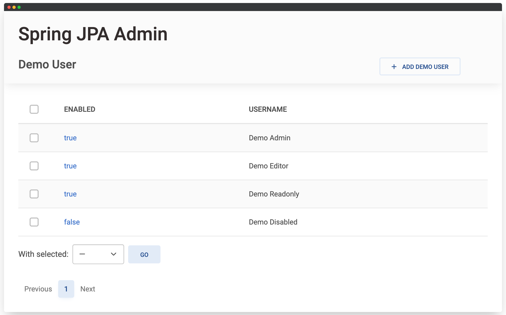  

### Customizing List Fields
First column is always a link leading to edit form, but we'll cover that later.
To start, we want to rearrange our list view columns:
```java
@AdminModel(listFields = {"username", "enabled"})
```
Restart admin site and open our entity again
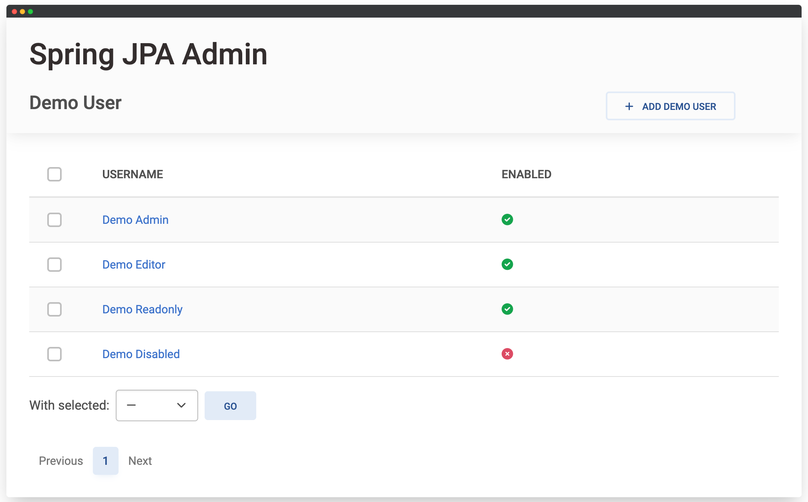
Much better. Also note, that `Enabled` column now contains cross- and check-marks instead of text because the field is of type boolean.

#### Filtering
Spring JPA Admin allows you to define filters to select specific records in the list view.
We want to quickly select only enabled or disabled users, let's modify our annotation:
```java
@AdminModel(
        listFields = {"username", "enabled"},
        filterFields = "enabled"
)
```
Restart the admin site and you will see the filter option for the enabled status in the list view:
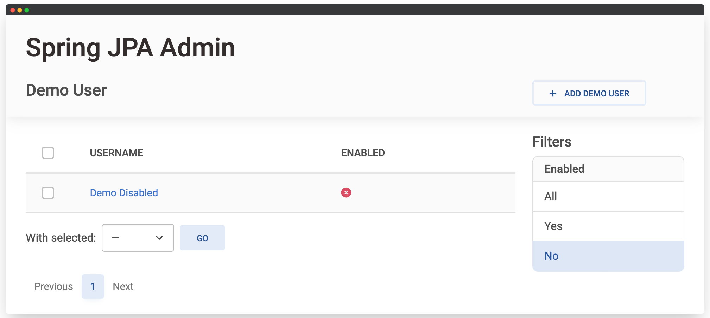
You can have as many filters for an entity as you'd like, but remember to add appropriate database indexes for query efficiency.

#### Custom List Fields
Sometimes, the entity's fields aren't sufficient to display all the required information.
Luckily, we can create custom list fields.
For example, let's add a custom field to display the number of posts for each Demo User:
```java
    public int getPostCount() {
        return posts.size();
    }
```
<sup>*Please note that while this approach is convenient for quick implementation, it can be inefficient and should not be used in real applications.*</sup>  
Update the `@AdminModel` annotation to include this custom field in the `listFields` attribute:
```java
@AdminModel(
        listFields = {"username", "postCount", "enabled"},
        filterFields = "enabled"
)
``` 
Let's see what we got as a result:
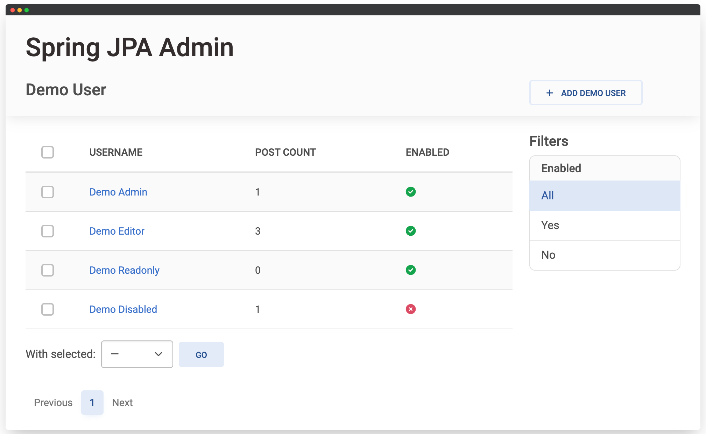

#### Sorting
Now let's say we want to be able to sort our Demo Users by username. Annotate `username` field with
```java
@AdminField(sortable = true)
```
Restart admin site, and now you can sort users!
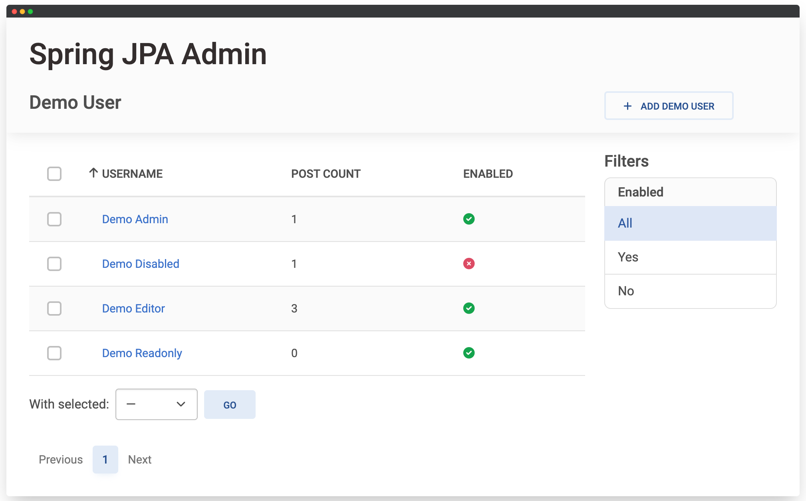
Most of the fields can be annotated with `sortable = true`.
For relation attributes you can specify `sortBy`. For example, if you want to sort Posts by author username, it will look like:
```java
@ManyToOne
@JoinColumn(name = "author_id")
@AdminField(sortBy = "username")
private DemoUser author;
```

#### Searching
Spring JPA Admin allows users to search for specific records in the list view.
To enable searching for Demo Users by their ids and usernames, modify the `@AdminModel` annotation to include the `searchFields` attribute (and remove the post count in the same time):
```java
@AdminModel(
        listFields = {"username", "enabled"},
        searchFields = {"id", "username"},
        filterFields = "enabled"
)
```
As before, restart admin site and try searching:
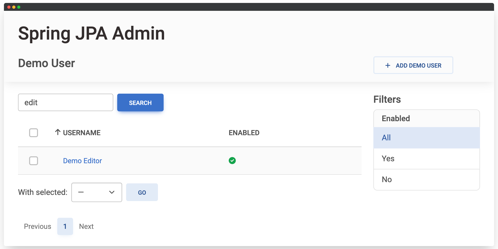

### Edit Restrictions
It is possible to disable creation or modification of any particular entity.
For example, you can disable the creation of new entities by setting `insertable = false` in the `@AdminModel` annotation.
Similarly, using `updatable = false` disables the modification of existing records while still allowing the creation of new ones.

### Bulk Actions
Spring JPA Admin allows performing bulk actions on selected records in the list view.
By default, only the "delete" action is enabled.
However, you can easily add your own custom actions.

#### Entity Custom Actions
To define a custom action for a specific entity, create static methods annotated with `@AdminAction`.
These methods operate on a list of selected entity records and can perform custom logic.
For example, let's define custom actions to enable and disable Demo Users:
```java
    @AdminAction
    public static void enable(List<DemoUser> users) {
        for (DemoUser user : users) {
            user.setEnabled(true);
        }
    }

    @AdminAction
    public static void disable(List<DemoUser> users) {
        for (DemoUser user : users) {
            user.setEnabled(false);
        }
    }
```
That's it! After restarting the admin site, the custom actions will be available for selected Demo Users in the list view:
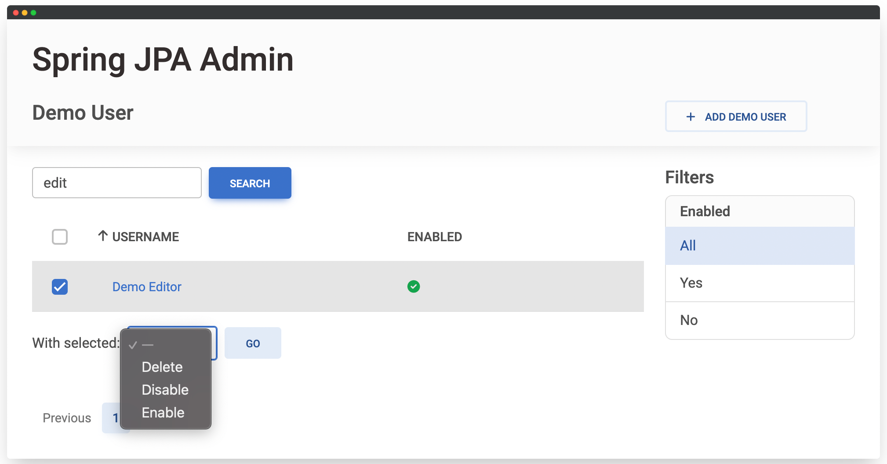
Methods for custom actions must be static (except for the case when they are defined on a separate model-admin class, more on this later) and must accept a single argument with the list of selected entity records.

#### Site-Wide Custom Action
If you need to create a site-wide list view custom action that applies to all entities, you can implement the `AdminModelAction` interface and register it as a Spring bean.
The default "delete" action is implemented using this approach.
  
Here's a complete example for the `DemoUser` entity with custom column ordering, enabled filtering, sorting, searching, custom actions, and disabled "delete" action:
```java
@Entity
@Table(name = "demo_user")
@AdminModel(
        listFields = {"username", "enabled"},
        searchFields = {"id", "username"},
        filterFields = "enabled",
        // Prohibit direct demo users creation or deletion
        insertable = false,
        disableActions = "delete"
)
public class DemoUser implements Serializable {

    @Id
    @Column(name = "id", updatable = false)
    private Integer id;

    @Size(min = 3, max = 15)
    @Column(name = "username", nullable = false)
    @AdminField(updatable = false, sortable = true)
    private String username;

    @Column(name = "enabled", nullable = false)
    private boolean enabled = true;

    @OneToMany(mappedBy = "author", orphanRemoval = true)
    private List<Post> posts = new ArrayList<>();

    @Version
    @Column(name = "version")
    private Integer version;

    @AdminAction
    public static void enable(List<DemoUser> users) {
        for (DemoUser user : users) {
            user.setEnabled(true);
        }
    }

    @AdminAction
    public static void disable(List<DemoUser> users) {
        for (DemoUser user : users) {
            user.setEnabled(false);
        }
    }
    ...
}
```
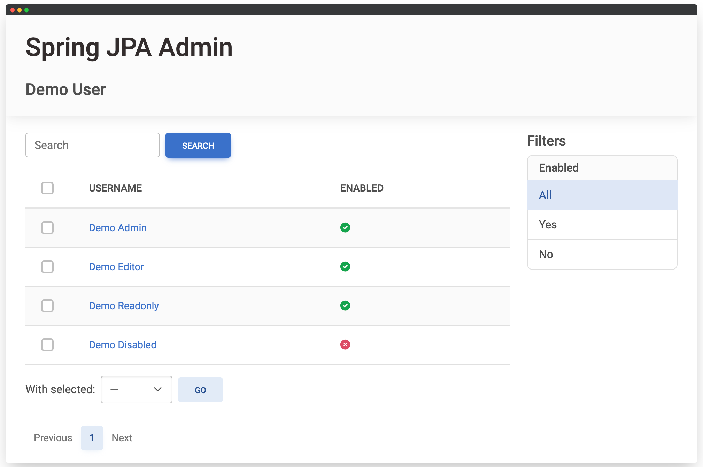

#### Field Representation
Custom field representation is used for both the list view and the form view.
Let's focus on the list view for now. Also, we'll switch to the `Post` entity.  
Remember the `author` field where we added a custom `sortBy` attribute? By default, it looks like this:
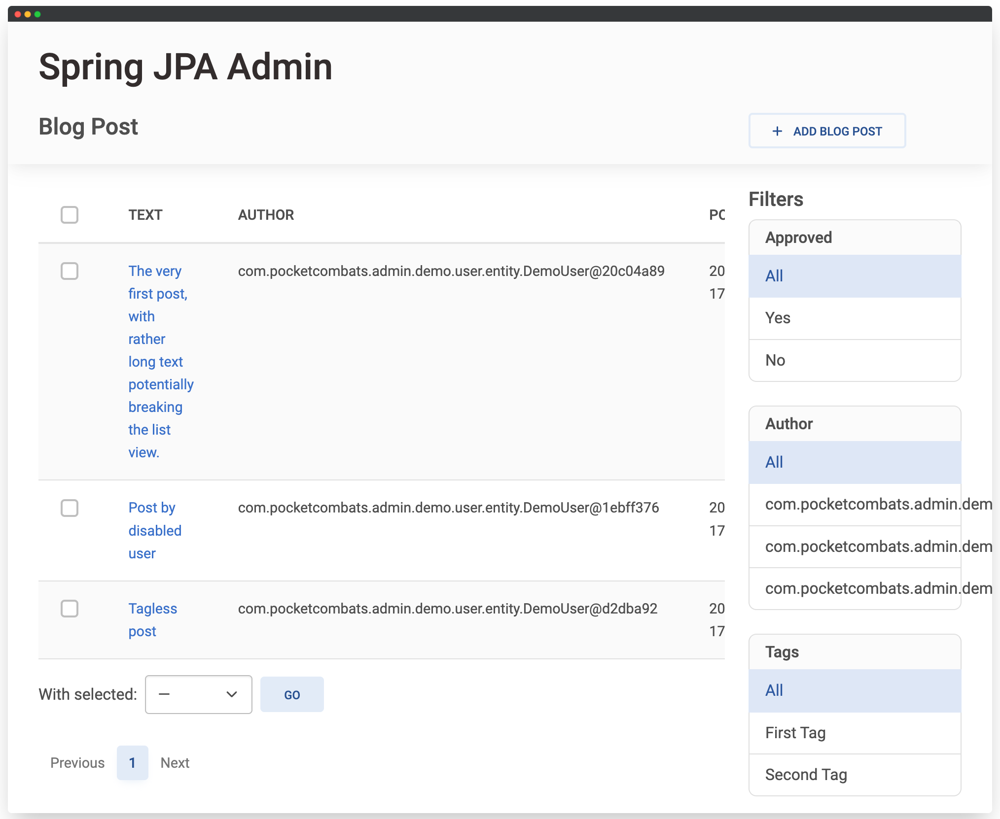
This default representation is simply the result of calling `.toString()`, which isn't very useful for most complex types.
The values for the `Author` filter also don't provide much help.  
Let's adjust the annotation to include a custom `representation`:
```java
@AdminField(sortBy = "username", representation = "username")
```
The result is much more helpful:
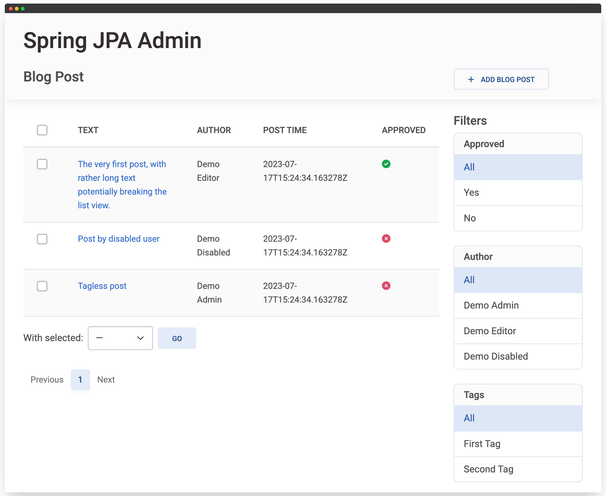
The `representation` is an expression in [SpEL](https://docs.spring.io/spring-framework/docs/3.0.x/reference/expressions.html) format, with the root object set to the entity being displayed.
In most cases, you simply want to reference a field, like `username` in our case, or call a method of an entity.
  
Next, let's do something with the `Text` field.  
We don't want to set a custom `representation` to avoid affecting the form view, so we'll provide a custom `listField` instead:
```java
    @AdminField(label = "Text")
    public String getTextPreview() {
        return StringUtils.abbreviate(getText(), 30);
    }
```
By setting the `label`, we can display the column title as "Text" instead of "Text Preview":
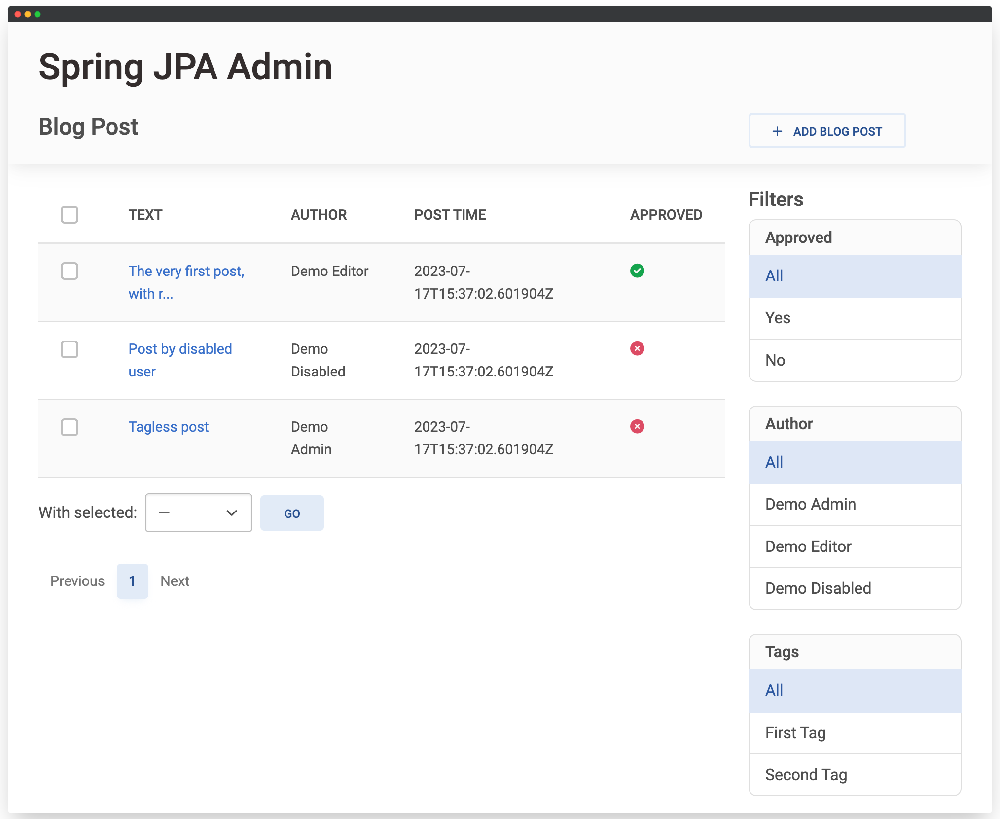

### Forms

#### Widgets and Custom Widgets

#### Validation

### Externalized Configuration

#### Custom Actions

### Localization
